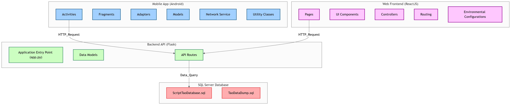
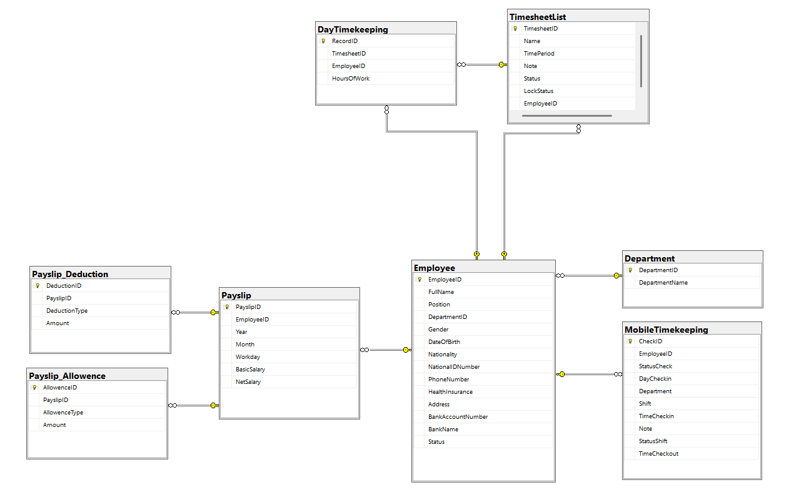
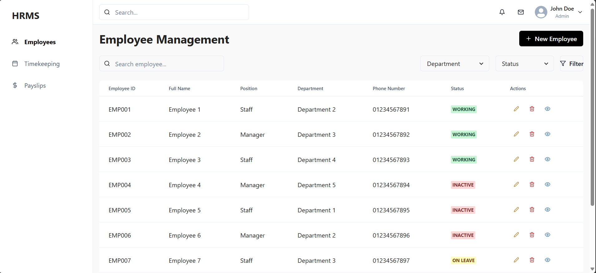
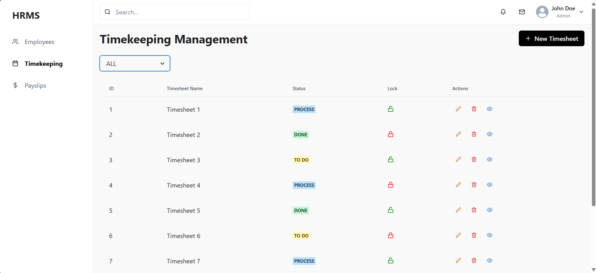
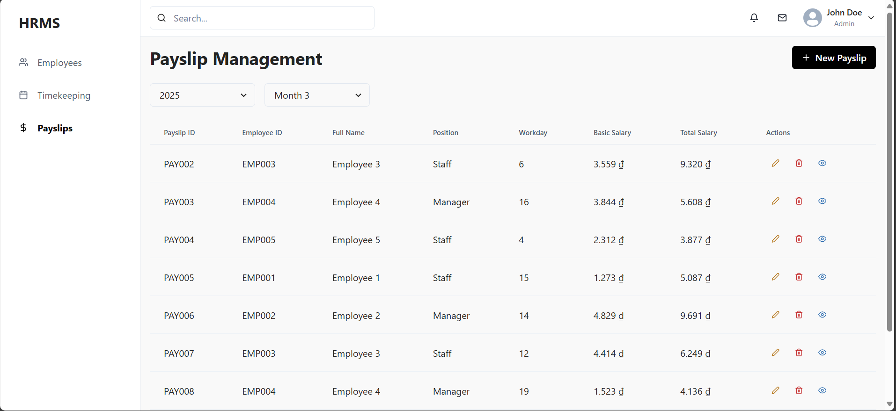
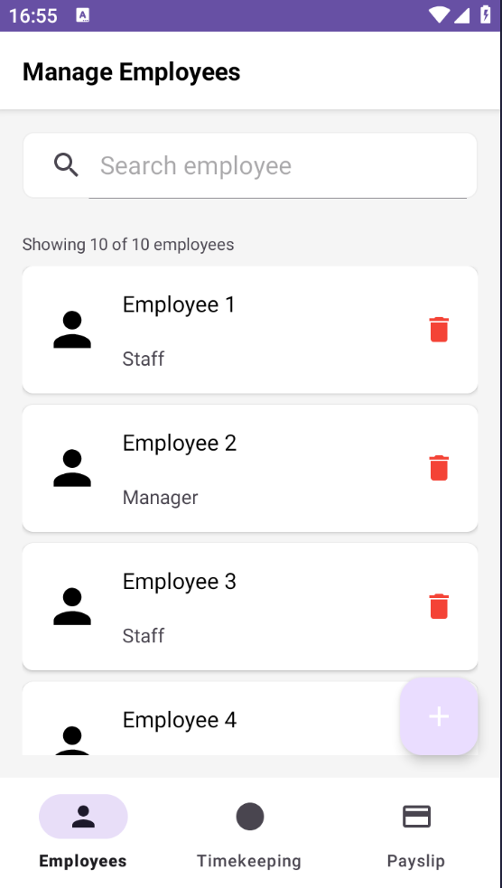
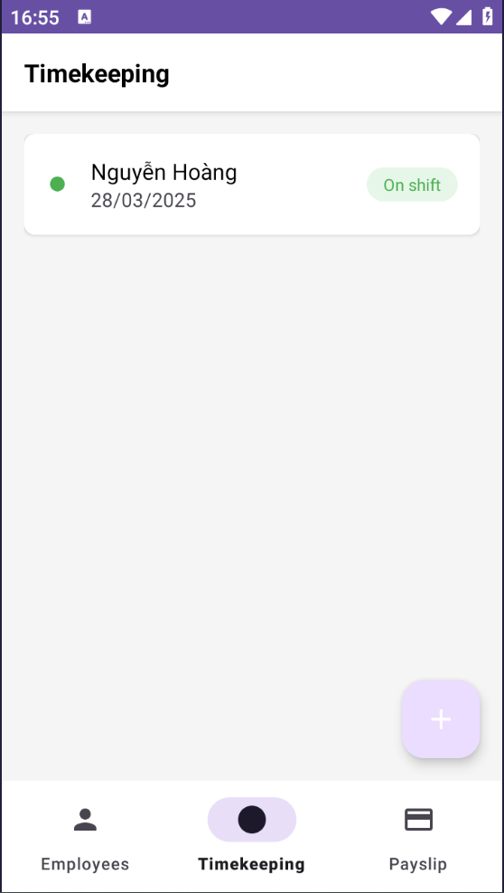
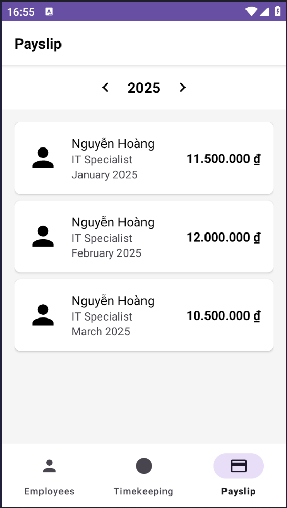

# Dự án 3: Hệ thống quản lý nhân sự (HRMS)

### Tác giả: Đinh Sỹ Quốc Doanh
### Đóng góp: Cao Văn Khánh Duy, Nguyễn Hoàng 
##
## Mô tả: Xây dựng hệ thống quản lý nhân sự cho doanh nghiệp nhỏ:	
- Quản lý thông tin nhân viên, bảng lương, chấm công.
- Kết nối API để tạo ứng dụng web cho nhân viên và bộ phận nhân sự.
- Tạo ứng dụng quản lý đơn giản qua giao diện web và ứng dụng di động.

## Git Diagram



## Sơ đồ ERD


## Screenshots
### Web app




### Mobile app
<table width="100%">
  <tbody>
    <tr>
      <td width="1%"></td>
      <td width="1%"></td>
      <td width="1%"></td>
    </tr>
  </tbody>
</table>

## Yêu cầu hệ thống
- Python 3.8 trở lên (Flask)
- Node.js 14 trở lên (ReactJs)
- Java
- SQL Server
- Git

## 1. Cài đặt Database
### 1.1. Cài đặt SQL Server
- Tải và cài đặt SQL Server từ [trang chủ Microsoft](https://www.microsoft.com/en-us/sql-server/sql-server-downloads)
  - Chọn phiên bản Developer hoặc Express (miễn phí)
  - Trong quá trình cài đặt, chọn "Basic" để cài đặt nhanh
  - Ghi nhớ instance name (mặc định là SQLEXPRESS)

- Tải và cài đặt SQL Server Management Studio (SSMS) từ [đây](https://docs.microsoft.com/en-us/sql/ssms/download-sql-server-management-studio-ssms)

### 1.2. Cấu hình SQL Server
1. Mở SQL Server Configuration Manager:
   - Bật SQL Server Browser
   - Bật TCP/IP trong SQL Server Network Configuration
   - Restart SQL Server service

2. Mở SSMS và kết nối với instance:
   - Server name: `localhost` hoặc `.\SQLEXPRESS`
   - Authentication: Windows Authentication hoặc SQL Server Authentication

### 1.3. Tạo Database
```sql
-- Tạo database
CREATE DATABASE HRMS;
GO

-- Sử dụng database
USE HRMS;
GO

-- Chạy ScriptTaoDatabase.sql
```

### 1.4. Import dữ liệu DUMP
```sql
-- Chạy các hàm và thủ tục trong TaoDataDump.sql
```

### 1.5. Cấu hình kết nối trong Backend
Sửa file `.env` trong thư mục `backend`:
```env
DB_DRIVER=ODBC Driver 17 for SQL Server
DB_SERVER=SQLEXPRESS  # hoặc tên SERVER của bạn
DB_NAME=HRMS
DB_USER=sa              # hoặc tài khoản SQL của bạn
DB_PASSWORD=your_password
DB_TRUST=yes           # Windows Authentication
```

## 2. Cài đặt Backend
### 2.1. Clone dự án
```bash
git clone <repository_url>
cd backend
```

### 2.2. Tạo môi trường ảo Python
```bash
# Windows
python -m venv venv
venv\Scripts\activate

# Linux/Mac
python3 -m venv venv
source venv/bin/activate
```

### 2.3. Cài đặt thư viện Python
```bash
cd backend
pip install -r requirements.txt
```

### 2.6. Khởi động backend server
```bash
# Development
flask run --reload

# Host to Android App local
flask run --host=0.0.0.0 --port=5000
```
Backend server sẽ chạy tại: http://localhost:5000

## 3. Cài đặt Frontend
### 3.1. Cài đặt dependencies
```bash
cd frontend
npm install
```

### 3.2. Cấu hình môi trường
Tạo file `.env` trong thư mục `frontend`:
```env
VITE_API_BASE_URL=http://localhost:5000/api
```

### 3.3. Khởi động frontend server
```bash
# Development
npm run dev
```
Frontend server sẽ chạy tại: http://localhost:3000

## 4. Kiểm tra hệ thống
Truy cập http://localhost:3000

